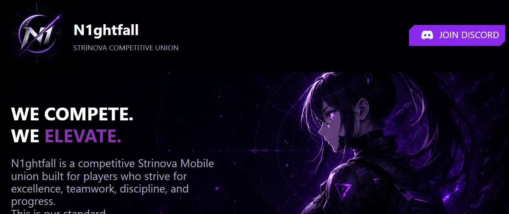
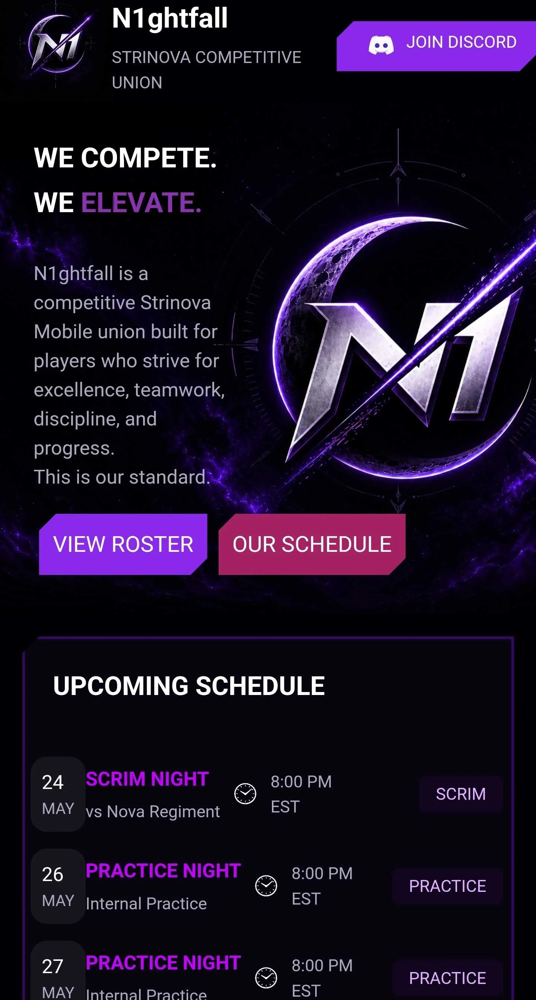

# N1ghtfall

[Live Site](https://james-york2008.github.io/n1ghtfall/)




## Overview

N1ghtfall is a competitive Strinova mobile union I plan on making when the global version of the game releases. This web application will serve as a web hub for team organization and recruiting new members. The page dynamically renders a schedule, roster, and requirements to join. Currently, most of the information is placeholder data.

## Run Locally

1. **Clone the repository:**

   ```bash
   git clone https://github.com/james-york2008/N1ghtfall
   cd N1ghtfall
   ```

2. **Install dependencies:**

   ```bash
   npm install
   ```

3. **Start the development server:**

   ```bash
   npm run dev
   ```

4. **View the app:**

Open your browser and navigate to `http://localhost:5173`

## Quality Checks

**Run automated tests:**

```bash
npm test -- --run
```

**Run code and markdown linting:**

```bash
npm run lint
```

## Stack

- **Framework:** ReactJS
- **Language:** TypeScript
- **Styling:** CSS
- **Build Tool:** Vite
- **Testing:** Vitest + React Testing Library
- **Routing:** React Router

## Challenges Faced and Lessons Learned

### Asset Management and Optimization

- **Scalability Bottlenecks:** Manual imports became unmanageable as the project grew
- **Vite Automation:** Transitioned to `import.meta.glob` to automate asset loading and improve maintainability
- **Performance Tuning:** Replaced large `.jpg` and `.png` files with high-performance `.webp` formats
- **Advanced Compression:** Leveraged `sharp` to re-encode images and drastically minimize bundle sizes

### Production Deployment Discrepancies

- **White Screen Build Bug:** Encountered a blank screen anomaly on GitHub Pages deployment
- **Environment Divergence:** Debugged discrepancies between local development and production environments
- **Core Learnings:** Mastered how bundlers process routing behaviors and relative asset paths during compilation

### Global vs. Scoped CSS Architecture

- **Style Bleeding:** Faced unintended side effects when styles inadvertently leaked across components
- **Visual Inconsistency:** Struggled to maintain a cohesive look across multiple disjointed files
- **Design Solution:** Learned the critical importance of scoped styling and strict design consistency

### Accessibility Improvements

- **Screen Reader Text:** Implemented a screen reader text component to add additional context for screen readers
- **Screen Reader pronunciation:** Used screen reader text to help assistive technologies with difficult spelling
- **Color Contrast Adjustments:** Altered the visual identity of the application to maintain accessible contrast ratios
- **Heading Hierarchy:** Ensured a logical `h1 -> h2 -> h3 -> h4` heading structure

### Automated Testing

- **Testing Framework:** Decided to use Vitest instead of Jest since this project already uses Vite
- **React Testing:** Used React Testing Library to test components based on user-visible behavior and accessibility
- **Accessible Queries:** Used semantic queries such as `getByRole` and accessible names to make the tests reflect how users interact with the app
- **Markdown linting:** Used `markdownlint-cli2` to lint markdown errors

#### Navbar Testing

- **Render Verification:** Confirmed the navbar and navigation landmark renders correctly
- **Discord Link:** Verified the Discord link uses the correct URL and security attributes
- **Logo Accessibility:** Ensured the logo has the correct alt text
- **Scree Reader Support:** Verified the visually stylized `N1ghtfall` title reads as `Nightfall` to assistive technologies

#### Hero Testing

- **Render Verification:** Confirmed the hero renders correctly
- **`h2` Text:** Ensured the `h2` element has the correct text content
- **Navigation links:** Verified the navigation links render with the correct attributes

### Code Quality

- **Indentation:** Standardized the amount of indentation across files to maintain a more organized, readable structure
- **Quotation Marks:** Replaced inconsistent `'` and `"` usage with consistent `"`

## Potential Future Improvements

- More thoroughly standardize the visual design system
- Replace placeholder data with real content
- Expand the application with community focused features like a match history section, or a media gallery for clips and highlights
- Add in depth player pages do display information and social media links
- Match history page to display match replays
- Implement either an about section or about page
- Reorganize folder structure to have a more scalable design
